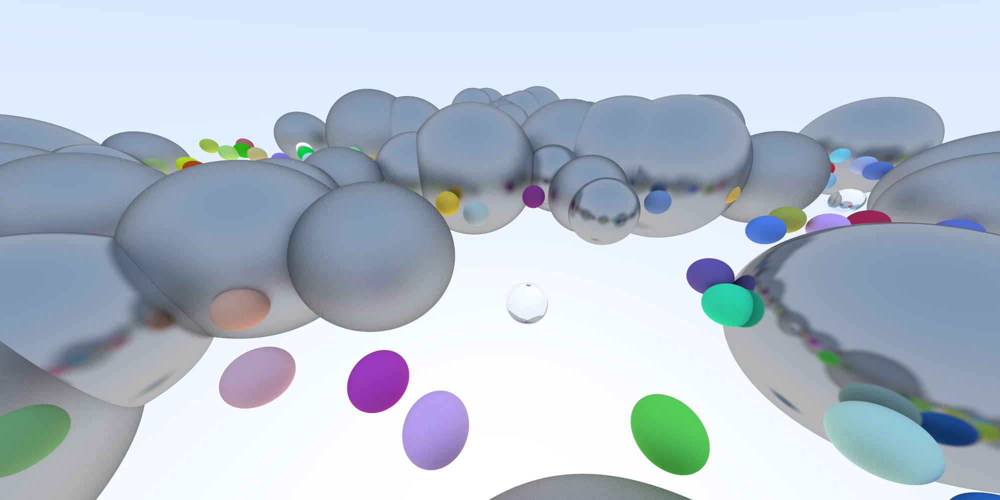

# foton

A small-ish super naive implementation of a ray tracer in Rust based on [a book series](https://www.goodreads.com/book/show/28794030-ray-tracing-in-one-weekend?ac=1&from_search=true) by Peter Shirley.

## Versions

- [One weekend](https://github.com/onbjerg/foton/tree/one-weekend): Naive single-threaded ray tracer with three types of materials and global illumination only.
- [One weekend (multi-threaded)](https://github.com/onbjerg/foton/tree/one-weekend-rayon): Naive multi-threaded ray tracer with three types of materials and global illumination only.
